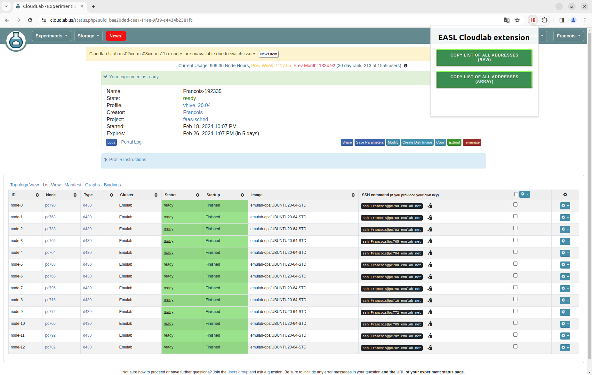

# EASL Cloudlab extension

## Install the extension

Enter this address on the navigator - the extension currently supports chrome only

> chrome://extensions 

Enable Developer Mode by clicking the toggle switch next to Developer mode.

Click the Load unpacked button and select the extension directory.

Then extension should be working

## How to use it

Go on the cloudlab page, select list view (see picture)

Click on the button to copy! 

